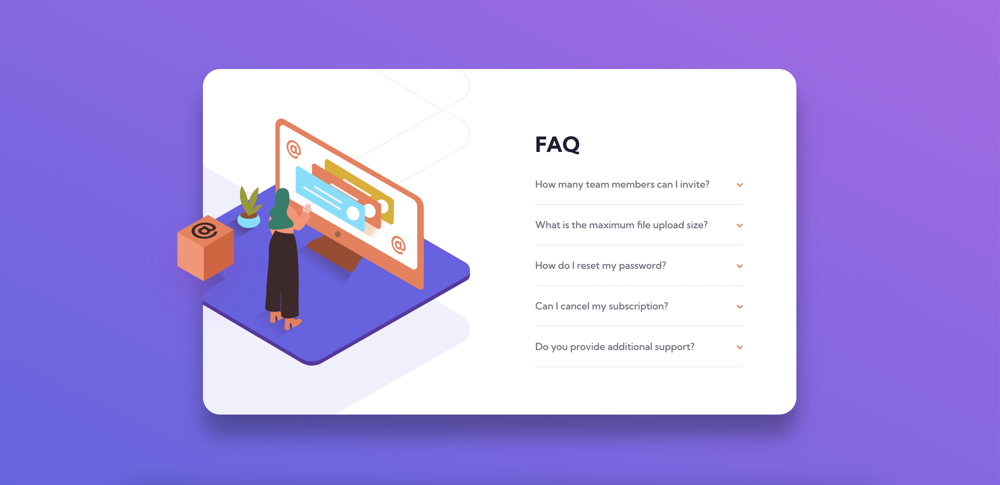

# Frontend Mentor - FAQ accordion card solution

This is a solution to the [FAQ accordion card challenge on Frontend Mentor](https://www.frontendmentor.io/challenges/faq-accordion-card-XlyjD0Oam). Frontend Mentor challenges help you improve your coding skills by building realistic projects. 

## Table of contents

- [Overview](#overview)
  - [The challenge](#the-challenge)
  - [Screenshot](#screenshot)
  - [Links](#links)
- [My process](#my-process)
  - [Built with](#built-with)
  - [What I learned](#what-i-learned)
  - [Useful resources](#useful-resources)
- [Author](#author)

## Overview

### The challenge

Users should be able to:

- View the optimal layout for the component depending on their device's screen size
- See hover states for all interactive elements on the page
- Hide/Show the answer to a question when the question is clicked

### Screenshot



### Links

- Solution URL: (https://www.frontendmentor.io/solutions/faq-accordion-card-SoN5sxlybH)
- Live Site URL: (https://coder-txane.github.io/faq-accordion-card-main/)

## My process

### Built with

- Semantic HTML5 markup
- CSS custom properties
- Flexbox
- CSS Grid
- Mobile-first workflow

### What I learned

I learned how to build an accordion. It's one of the things I wanted to make as it's a common feature on the FAQs section of a website. I found that using ```<details>``` and ```<summary>``` are best for this.

```
html
<h1>FAQ</h1>
<details>
  <summary>How many team members can I invite?</summary>
    <p>You can invite up to 2 additional users on the Free plan. There is no limit on 
    team members for the Premium plan.</p>
</details>
```

### Useful resources

- [CSS Tricks](https://css-tricks.com/) - This helped me with all my CSS needs. I really liked how it examples CSS concepts in a clear and visual way and will use it going forward.

## Author

- Frontend Mentor - [@coder-txane](https://www.frontendmentor.io/profile/coder-txane)